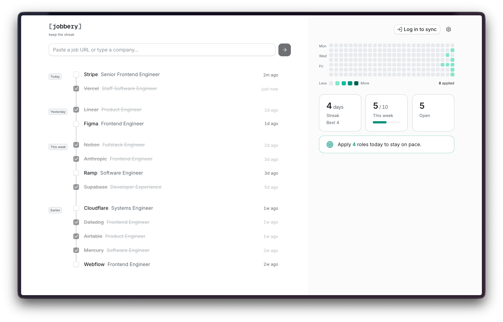
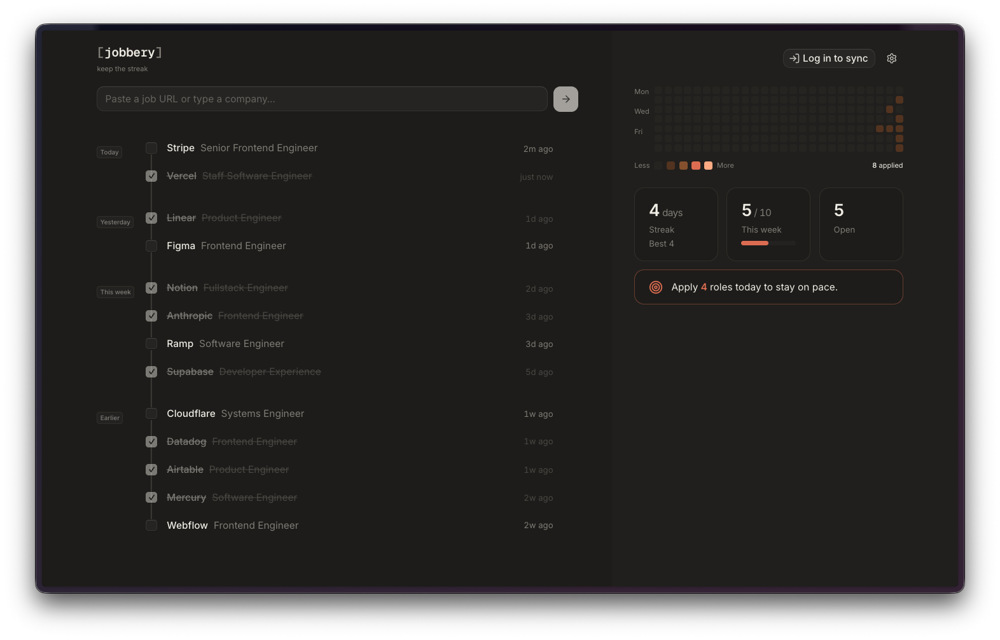

<div align="center">

# `[ jobbery ]`

### Keep the streak.

A friction-free job-application tracker. Paste a link, hit enter, watch your streak grow. Built to make *applying* a daily habit — not bookkeeping.

<br />



<br /><br />



<br />

</div>

---

## Why

Most trackers are spreadsheets in disguise — they make you *log*, not *apply*. jobbery flips it: a single field, instant capture, a contribution heatmap, and a weekly target that nudges you to keep the streak alive. The whole app is one screen.

## Features

- **One-field capture** — paste a job URL or type a company. A server route fetches page metadata to fill in the role + company; known job boards are recognized by regex on every keystroke.
- **Contribution heatmap** — a GitHub-style calendar of everywhere you applied. Streaks, "this week vs. target," and open count at a glance.
- **Weekly target** — set a goal; the app tells you how many more roles to apply to today to stay on pace.
- **Themeable** — a dozen+ themes (Dark, Light, GitHub, Claude, Tangerine, Lavender, Sunset…), live-applied and persisted.
- **Optional account** — works fully offline as a guest (localStorage). Log in with Google, GitHub, or a passwordless magic link to sync across devices. Guest data migrates to your account on first login.
- **Works from Claude** — a built-in [MCP server](#connect-to-claude-mcp) lets Claude log applications, read a job URL, and answer "am I on pace?" without you opening the app.
- **Privacy by default** — guest mode makes zero network calls; your data stays in the browser until you choose to sync.

## Tech stack

| Layer | Choice |
|---|---|
| Framework | [Next.js 16](https://nextjs.org) (App Router) + React 19 |
| Styling | Tailwind CSS v4 |
| UI primitives | [Base UI](https://base-ui.com), lucide icons |
| Motion | Framer Motion |
| Auth + DB | [Supabase](https://supabase.com) (OAuth + magic link, Postgres with RLS) |
| Agent interface | [MCP](https://modelcontextprotocol.io) over Streamable HTTP (`mcp-handler`) |
| Hosting | [Vercel](https://vercel.com) |

## Getting started

```bash
npm install
npm run dev
```

Open [http://localhost:3000](http://localhost:3000). With no environment configured, the app runs in **guest mode** (localStorage only) — no setup needed to try it.

### Enable sync (Supabase)

Auth and cross-device sync are optional. To turn them on:

1. **Create a Supabase project** (directly or via the Vercel Marketplace).
2. **Run the schema** — paste [`supabase/migrations/0001_init_auth_schema.sql`](supabase/migrations/0001_init_auth_schema.sql), then [`0002_api_tokens.sql`](supabase/migrations/0002_api_tokens.sql), into the Supabase SQL editor. The first creates the `applications` and `user_settings` tables with row-level security scoped to `auth.uid()`; the second adds the `api_tokens` table the MCP server authenticates against.
3. **Enable providers** — in Supabase → Auth → Providers, turn on Google, GitHub, and Email; paste each OAuth app's client id/secret. Add `http://localhost:3000/auth/callback` (and your production URL) to the redirect allow-list.
4. **Set env vars** in `.env.local`:

   ```bash
   NEXT_PUBLIC_SUPABASE_URL=your-project-url
   NEXT_PUBLIC_SUPABASE_PUBLISHABLE_KEY=your-publishable-key
   # Only needed for the MCP server (below). Server-side secret — never prefix it
   # with NEXT_PUBLIC_, and set it in Vercel as a plain environment variable.
   SUPABASE_SECRET_KEY=your-service-role-key
   ```

Restart the dev server. Visiting the app now routes through `/login`; "Skip for now" still drops you into guest mode.

## Connect to Claude (MCP)

jobbery ships an [MCP](https://modelcontextprotocol.io) server at `/api/mcp`, so Claude can log applications and answer "am I on pace?" without you opening the app. It needs sync enabled (above) — guest data lives in your browser and has nothing to connect to.

1. Open **Settings → Connect to Claude** and create a token. The token is shown **once**; copy it.
2. Register it:

   ```bash
   claude mcp add --transport http jobbery https://your-app.vercel.app/api/mcp \
     --header "Authorization: Bearer jbry_your-token"
   ```

   Against a dev server, swap the URL for `http://localhost:3000/api/mcp`.

Revoke a token any time from the same panel — it stops working immediately. To poke at the server directly:

```bash
npx @modelcontextprotocol/inspector
```

Point it at the same URL with an `Authorization: Bearer …` header. Without a valid token every request answers **401** — the endpoint is excluded from the cookie gate in `proxy.ts` precisely so clients get a real 401 instead of an HTML redirect to `/login`.

| Tool | What it does |
|---|---|
| `log_application` | Record an application (or queue one); returns the refreshed streak and pace |
| `list_applications` | Read applications, filterable by status, date range, or company |
| `update_application` | Edit a record — most often flipping a queued role to applied |
| `delete_application` | Permanently remove a record |
| `get_stats` | Streak, best, today/this week, weekly target, how many more today |
| `parse_job_url` | Pull company + role out of a job posting URL |
| `set_weekly_target` | Change the weekly goal |

Only the SHA-256 hash of a token is stored, so a lost token gets revoked and replaced rather than recovered. Because a bearer token carries no Supabase session, the route resolves it to a user itself and queries with the service-role key — which bypasses row-level security. Every store call carries that user id explicitly; read the note in [`lib/supabase/service.ts`](lib/supabase/service.ts) before adding queries there.

**Day boundaries:** streaks and "this week" are bucketed in your local time. The web app records your IANA zone on first signed-in load; until it has, `get_stats` falls back to UTC and may disagree with the dashboard by a few hours around midnight. Loading the app once fixes it.

## How it's built

The storage layer is a single `Storage` interface (`lib/storage.ts`) with three implementations swapped behind it:

- **`LocalStorageStore`** — guest / offline.
- **`SupabaseStore`** — remote, user-scoped, RLS-enforced.
- **`CachedStore`** — wraps the remote store with a per-user localStorage cache (optimistic writes, remote-authoritative reads).

The `useApplications` hook picks the right store from the auth state, so components never know whether data lives in the browser or Postgres. Auth gating happens at the edge in `proxy.ts` (Next.js 16's middleware); a guest cookie lets users in without a session.

The MCP server reuses that same seam — it's `SupabaseStore` over a service-role client, wrapped in token auth. Two modules exist specifically so the two surfaces can't drift: `lib/stats.ts` derives every momentum number for both the dashboard and `get_stats`, and `lib/job-metadata.ts` owns the URL fetch (and its SSRF guard) for both `/api/parse` and `parse_job_url`. Day bucketing in `lib/date.ts` takes an optional IANA zone, because the browser's local time is the user's but a Vercel function's is UTC.

## Scripts

| Command | Description |
|---|---|
| `npm run dev` | Start the dev server |
| `npm run build` | Production build |
| `npm start` | Serve the production build |
| `npm run lint` | Lint with ESLint |

---

<div align="center">
<sub>Built with Next.js + Supabase. Keep the streak. 🔥</sub>
</div>
